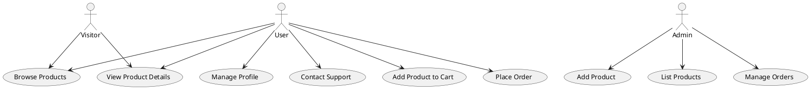
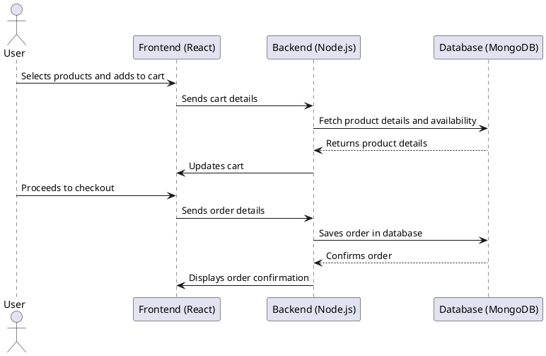
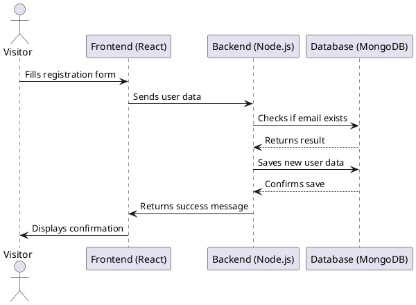
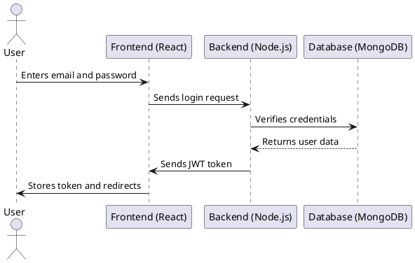
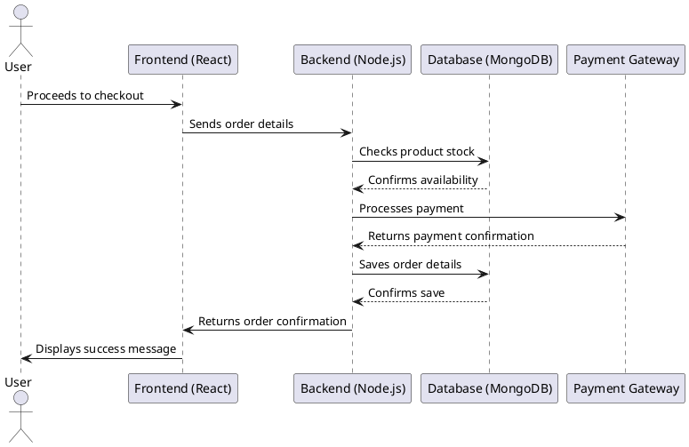
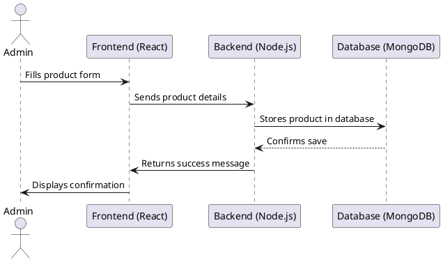
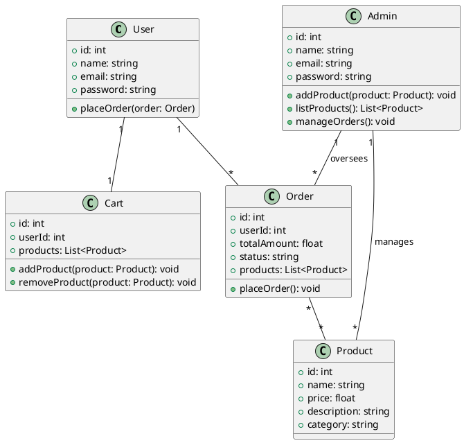

# E-commerce Website

## Project Overview
This project is a fully functional **e-commerce website** built using the **MERN stack (MongoDB, Express.js, React, Node.js)** and follows the **MVC (Model-View-Controller) architecture**. It allows users to browse products, add them to their cart, place orders, and manage their profiles. Admins can manage products and orders.

## Features
### **User Functionalities**
- Browse products
- Add products to cart
- Place orders
- Manage profile
- Contact support

### **Admin Functionalities**
- Add new products
- List all products
- Manage orders

### **Visitor Functionalities**
- Browse products
- View product details

## **Architecture: MVC with MERN Stack**
The project follows the **MVC (Model-View-Controller)** pattern:
- **Model (MongoDB):** Handles database interactions (User, Product, Order, etc.)
- **View (React.js):** User interface (Frontend pages)
- **Controller (Express.js & Node.js):** Manages logic and communication between Model and View


## **Use Case Diagram (UML)**
The following diagram represents the **use case interactions** of the project:




## **Sequence Diagram (UML)**
- The following diagram represents the **order placement process**:




- The following diagram represents the **account creation process**:



)

- The following diagram represents the **login process**:




- The following diagram represents the **Checkout & Payment process**:




- The following diagram represents the **Admin Adds a Product process**:




## **Class Diagram (UML)**
The following diagram represents the **class structure** of the project:




## **Screenshots**


## **Installation & Setup**
### **1. Clone the Repository**
```sh
git clone https://github.com/abdelfadelAchraf/E-commerce-website.git
cd E-commerce-website
```

### **2. Install Dependencies**
```sh
npm install  # Install backend and frontend dependencies
```


### **4. Run the Project**
```sh
cd frontend 
npm run dev  # Starts the frontend part 
```
```sh
cd admin 
npm run dev  # Starts the admin dashboard
```
```sh
cd backend 
npm run server  # Starts the backend part
```


## **Environment Variables**
Create a `.env` file in the root directory and add:
```env
MONGO_DB_URL="mongodb+srv://<username>:<password>@clusterwebcommerce.luxe3.mongodb.net"
PORT="4000"
CLOUDINARY_API_KEY="your-api-key"
CLOUDINARY_SECRET_KEY="your-secret-key"
CLOUDINARY_CLOUD_NAME="your-cloud-name"
JWT_SECRET="your-secret-jwt-key"
ADMIN_EMAIL="admin@example.com"
ADMIN_PASSWORD="your-admin-password"

```

## **API Endpoints**
### **User Routes**
- `POST /api/users/register` - Register a new user
- `POST /api/users/login` - Authenticate user & get token
- `GET /api/users/profile` - Get user profile (protected)

### **Product Routes**
- `GET /api/products` - Get all products
- `GET /api/products/:id` - Get product details

### **Order Routes**
- `POST /api/orders` - Place an order (protected)
- `GET /api/orders/:id` - Get order details (protected)

## **Authentication & Authorization**
- **JWT (JSON Web Token)** is used for authentication.
- Passwords are **hashed** using `bcrypt`.
- Protected routes require a **valid token**.


## **Future Enhancements**
- **Payment Gateway Integration** (Stripe, PayPal)
- **Wishlist Functionality**
- **Reviews and Ratings System**

## **License**
This project is open-source and available under the **MIT License**.

---


